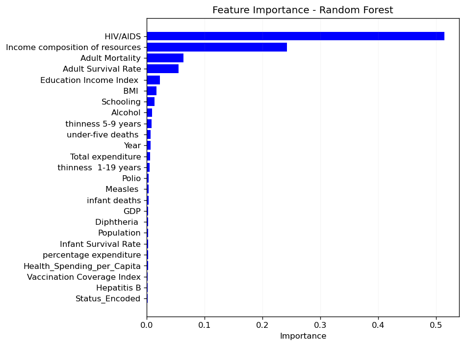

# Predicting Life Expectancy from Health & Economic Indicators

I built and compared four regression models to predict a country's life expectancy from health, economic, and social indicators. The best model, a tuned Random Forest, explains about 96% of the variance in life expectancy on held-out data.

Beyond the accuracy, the analysis surfaces which factors drive the predictions: HIV/AIDS prevalence and income composition of resources dominate, together accounting for most of the model's decisions.

## What I did

- Explored a WHO dataset of 2,938 country-year records (2000-2015) across 22 indicators, including the developed/developing life-expectancy gap over time.
- Handled missing data with KNN imputation and treated skewed outliers (GDP, health spending) with IQR capping instead of dropping a third of the rows.
- Engineered five new features; one of them, an education-income index, correlated with life expectancy more strongly than either of its parts.
- Tuned Decision Tree, Random Forest, KNN, and Gradient Boosting with 5-fold cross-validation, then compared them on RMSE, MAE, and R².
- Pulled feature importances from the best model and tested a reduced 5-feature version to weigh accuracy against simplicity.

## Results

| Model | Test RMSE | Test R² |
|-------|-----------|---------|
| Random Forest | ~1.7 years | ~0.97 |
| Gradient Boosting | ~1.9 years | ~0.96 |
| KNN | ~2.2 years | ~0.95 |
| Decision Tree | ~2.5 years | ~0.93 |


The top-5-feature Random Forest kept almost all of the full model's accuracy while using a quarter of the inputs, which is a good tradeoff if the goal is an interpretable, policy-facing tool.



## A note on methodology

Preprocessing that learns from the data (KNN imputation, scaling) is fit on the training set only, inside an sklearn `Pipeline`, so no test information leaks into training and cross-validation stays honest.

## Dataset

A WHO-derived dataset of 2,938 country-year records (2000-2015) with 22 health, economic, and social indicators and a single life-expectancy target. This is a coursework-modified version of the widely-circulated Kaggle "Life Expectancy (WHO)" data; the columns differ from the current Kaggle release (which splits several fields by sex). The exact CSV used here is included in this repo as `life_expectancy.csv`.

## Running it

```bash
pip install -r requirements.txt
jupyter notebook notebooks/life_expectancy_prediction.ipynb
```

Then run the cells top to bottom. The plots save into `images/`.

## Repo layout

```
notebooks/   the full analysis
images/      generated plots (trend, correlation, feature importance)
requirements.txt
```
